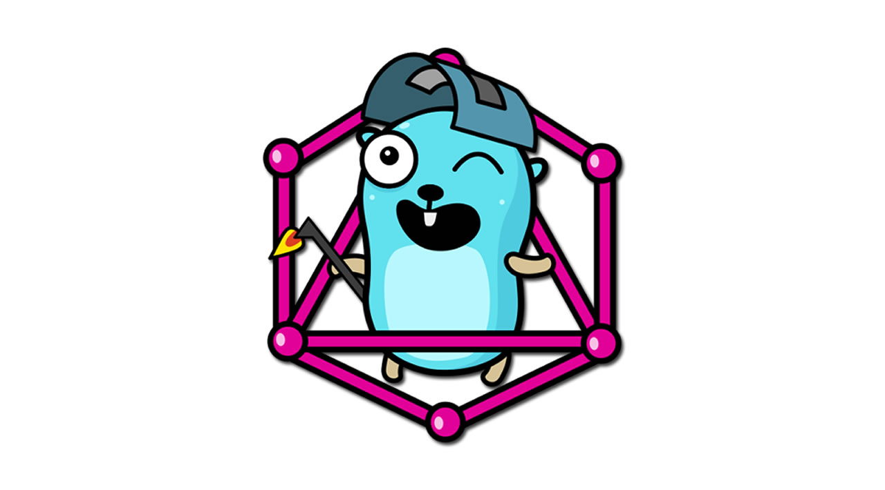
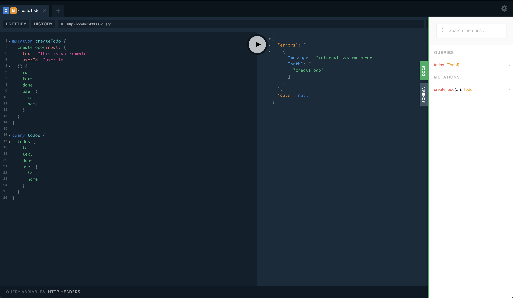

# go-graphql-example

An example go web server implementing a GraphQL api with a Sqlite database.

**Read the full article: https://shellbear.me/blog/go-graphql-api**



## Usage

Using `go run`:
```shell
> go run main.go
2020/xx/xx xx:xx:xx connect to http://127.0.0.1:8080/ for GraphQL playground
```

Using `go build`:
```shell
> go build -o go-graphql-example .
> ./go-graphql-example
2020/xx/xx xx:xx:xx connect to http://127.0.0.1:8080/ for GraphQL playground
```

You can access the GraphQL playground at: [http://127.0.1:8080/](http://127.0.1:8080/)

[](http://127.0.1:8080/)

## Development

After making changes to `ent/schema` or `graph` directory make sure to run the generate command:
```shell
go generate ./...
```

## Database

Database models are handled with [ent](https://entgo.io/).

Follow the [instructions](https://entgo.io/docs/getting-started/) to install the ent CLI.

To add a new model:
```shell
ent init [Model]
```

And start editing the new Model schema in `ent/schema/[model].go`.

Then run the code generation tool:
```shell
go generate ./...
```

## GraphQL

GraphQL API is managed with [gqlgen](https://gqlgen.com/).

To update the API, edit the schema in `graph/schema.graphqls` or a create a new schema named: `graph/*.graphqls`.

After making changes, run the code generation tool:
```shell
go generate ./...
```

And implement code logic inside `graph/[schema].resolers.go`.

## Built with

- [ent](https://github.com/ent/ent)
- [gqlgen](https://github.com/99designs/gqlgen)
- [go-sqlite3](https://github.com/mattn/go-sqlite3)